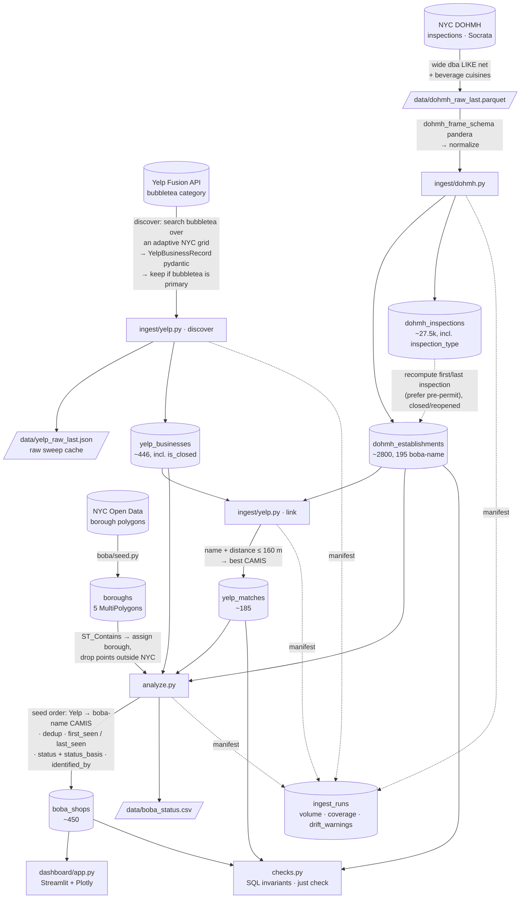

# Pipeline

`just all`: `db-up → migrate → seed → ingest-dohmh → ingest-yelp → analyze → check`.

Yelp is the **primary discovery source** (its curated `bubbletea` category);
DOHMH supplies the first-observed date. Yelp linking runs after DOHMH ingest
because it matches each Yelp business against the DOHMH points. The output is a
current census, not an openings/closings timeline — see [decisions.md](decisions.md).

## The seams

| Stage | Contract / guard |
|---|---|
| Yelp discover | `YelpBusinessRecord` pydantic per business; kept only if `bubbletea` is its **primary** category (or the name matches) — drops ~260 restaurants that merely serve boba; raw sweep cached to `data/yelp_raw_last.json`; mark-and-sweep guarded against a rate-limited thin sweep |
| Yelp link | name + distance within 160 m against DOHMH points, kept at `name_sim ≥ 60` |
| DOHMH ingest | pandera on the frame — hard-fails on bad `camis`; warns on unknown `action` / out-of-NYC coords |
| every ingest | `ingest_runs` row + `drift_warnings()` vs the last good run |
| schema | `alembic check` — models ↔ migration ↔ DB |
| post-run | `checks.py` — FK resolution, date order, status enums, `yelp_matches` integrity |

Yelp discovery is skipped if the last successful `yelp_discover` run was within
`--max-age-days` (default 14); `--rediscover` forces a fresh sweep. The whole
Yelp stage no-ops without `YELP_API_KEY` (the set is then just the DOHMH
boba-name tail).

See [methodology.md](methodology.md) for identification / linking / date logic,
[data-sources.md](data-sources.md) for why two sources, and
[decisions.md](decisions.md) for infrastructure choices.
