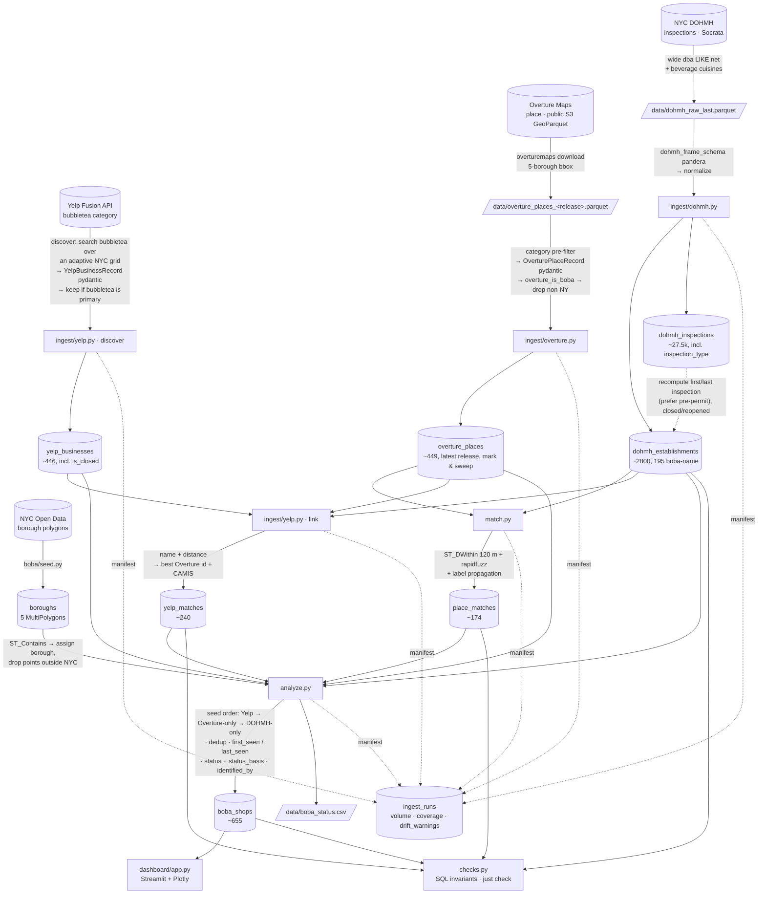

# Pipeline

`just all`: `db-up → migrate → seed → ingest-overture → ingest-dohmh → match → ingest-yelp → analyze → check`.

Yelp is the **primary discovery source** (its curated `bubbletea` category);
Overture supplies brand + geometry, DOHMH supplies the timeline. Yelp linking
runs *after* `match` because it reuses the Overture/DOHMH points.

## The seams

| Stage | Contract / guard |
|---|---|
| Yelp discover | `YelpBusinessRecord` pydantic per business; a business is kept only if `bubbletea` is its **primary** category (or the name matches) — drops ~260 restaurants that merely serve boba; mark-and-sweep guarded against a rate-limited thin sweep |
| Yelp link | name + distance within 160 m against Overture and DOHMH points; kept only at `name_sim ≥ 60` |
| Overture ingest | pydantic per record — fails on unknown `operating_status`, bad `confidence`, missing `categories`; aborts if >10% of candidates fail |
| DOHMH ingest | pandera on the frame — hard-fails on bad `camis`; warns on unknown `action` / out-of-NYC coords |
| every ingest | `ingest_runs` row + `drift_warnings()` vs the last good run |
| schema | `alembic check` — models ↔ migration ↔ DB |
| post-run | `checks.py` — FK resolution, score ranges, date order, status enums, `yelp_matches` integrity |

Yelp discovery is skipped if the last successful `yelp_discover` run was within
`--max-age-days` (default 14); `--rediscover` forces a fresh sweep. The whole
Yelp stage no-ops without `YELP_API_KEY`.

See [methodology.md](methodology.md) for identification / matching / date logic,
[data-sources.md](data-sources.md) for why three sources, and
[decisions.md](decisions.md) for infrastructure choices.
