# Pipeline

`just all`: `db-up → migrate → seed → ingest-overture → ingest-dohmh → match → ingest-yelp → analyze → check`.

```mermaid
flowchart TD
    OV[(Overture Maps<br/>place · public S3 GeoParquet)]
    DH[(NYC DOHMH<br/>inspections · Socrata)]
    NB[(NYC Open Data<br/>borough polygons)]
    YP[(Yelp Fusion API)]

    NB -->|boba/seed.py| BORO[(boroughs<br/>5 MultiPolygons)]

    OV -->|overturemaps download<br/>5-borough bbox| OVDL[/data/overture_places_&lt;release&gt;.parquet/]
    DH -->|wide dba LIKE net<br/>+ beverage cuisines| DHDL[/data/dohmh_raw_last.parquet/]

    OVDL -->|category pre-filter<br/>→ OverturePlaceRecord pydantic<br/>→ overture_is_boba → drop non-NY| OVI[ingest/overture.py]
    DHDL -->|dohmh_frame_schema pandera<br/>→ normalize| DHI[ingest/dohmh.py]

    OVI --> OP[(overture_places<br/>~449, latest release, mark & sweep)]
    DHI --> DE[(dohmh_establishments<br/>~2800, 195 boba-name)]
    DHI --> DI[(dohmh_inspections<br/>~27.5k, incl. inspection_type)]
    DI -. recompute first/last inspection<br/>(prefer pre-permit), closed/reopened .-> DE

    OP --> M[match.py]
    DE --> M
    M -->|ST_DWithin 120 m + rapidfuzz<br/>+ label propagation| PM[(place_matches<br/>~170)]

    OP --> Y[ingest/yelp.py]
    DE --> Y
    YP -->|/businesses/matches by name+address<br/>→ /businesses/&#123;id&#125; is_closed| Y
    Y --> YS[(yelp_status<br/>current open/closed)]

    OP --> A[analyze.py]
    DE --> A
    PM --> A
    YS --> A
    BORO -->|ST_Contains → assign borough,<br/>drop points outside NYC| A
    A -->|3 populations · dedup · first_seen / last_seen<br/>· status + status_basis · identified_by| BS[(boba_shops<br/>~512)]
    A --> CSV[/data/boba_status.csv/]

    BS --> DASH[dashboard/app.py<br/>Streamlit + Plotly]

    OVI -. manifest .-> IR[(ingest_runs<br/>volume · coverage · drift_warnings)]
    DHI -. manifest .-> IR
    M -. manifest .-> IR
    Y -. manifest .-> IR
    A -. manifest .-> IR

    BS --> CHK[checks.py<br/>SQL invariants · just check]
    PM --> CHK
    DE --> CHK
```

## The seams

| Stage | Contract / guard |
|---|---|
| Overture ingest | pydantic per record — fails on unknown `operating_status`, bad `confidence`, missing `categories`; aborts if >10% of candidates fail |
| DOHMH ingest | pandera on the frame — hard-fails on bad `camis`; warns on unknown `action` / out-of-NYC coords |
| Yelp | 2 calls per target, capped (`--limit`) + cached (skip if checked < `--max-age-days`); no-ops without `YELP_API_KEY` |
| every ingest | `ingest_runs` row + `drift_warnings()` vs the last good run |
| schema | `alembic check` — models ↔ migration ↔ DB |
| post-run | `checks.py` — FK resolution, score ranges, date order, status enums |

See [methodology.md](methodology.md) for matching / borough / date logic,
[data-sources.md](data-sources.md) for why three sources, and
[decisions.md](decisions.md) for infrastructure choices.
