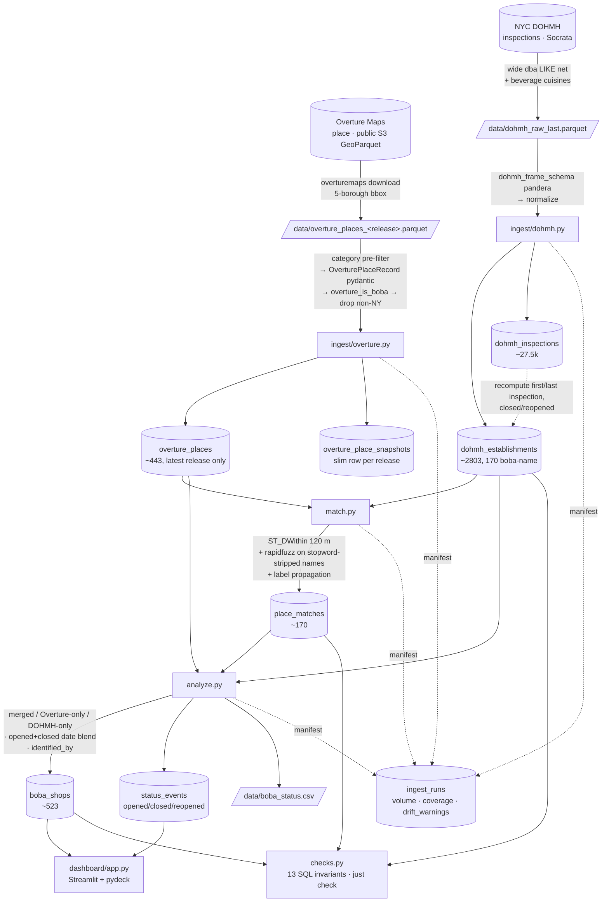

# Pipeline

`just all` runs: `db-up → migrate → ingest-overture → ingest-dohmh → match → analyze → check`.

## The seams

| Stage | Contract / guard |
|---|---|
| Overture ingest | pydantic per record — fails on unknown `operating_status`, bad `confidence`, missing `categories`; aborts if >10% of candidates fail |
| DOHMH ingest | pandera on the frame — hard-fails on bad `camis`; warns on unknown `action` / out-of-NYC coords |
| every ingest | `ingest_runs` row + `drift_warnings()` vs the last good run |
| schema | `alembic check` — models ↔ migrations ↔ DB |
| post-run | `checks.py` — FK resolution, score/date ranges, status enums, the 1900 sentinel |

See [methodology.md](methodology.md) for the matching and date-blending logic,
[data-sources.md](data-sources.md) for why two sources, and
[decisions.md](decisions.md) for infrastructure choices.
